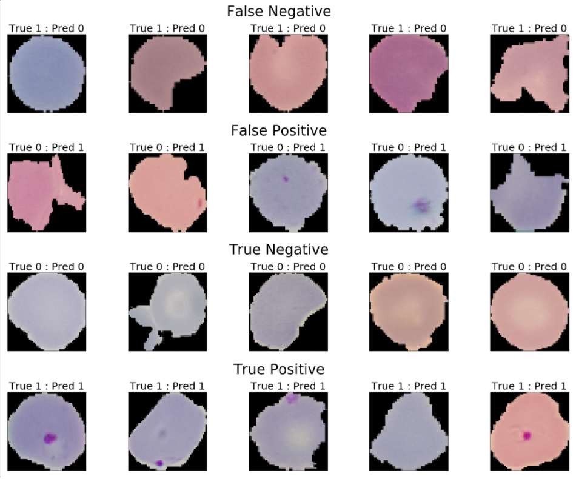

# Introduction
Malaria is a life-threatening disease caused by parasites that are transmitted to people through the bites of infected female Anopheles mosquitoes. It is preventable and curable. In 2019, there were an estimated 229 million cases of malaria worldwide. The estimated number of malaria deaths stood at 409 000 in 2019. -via https://www.who.int/news-room/fact-sheets/detail/malaria
In this notebook I will be building a model for detecting malaria from images of blood cells. The dataset of 27,558 cell images (equal amounts of parasitized and uninfected) were taken from Giemsa-stained thin blood smear slides.
The dataset and more information can be found at https://ceb.nlm.nih.gov/repositories/malaria-datasets/
The goal of this project was to learn more about the modeling process in TensorFlow, as well as gain intuition on data augmentation.  I spent a good amount of time learning about input pipelines with TF, but ended up inputing the images normally.

# Usage
In order to run this notebook, you will need the dataset (linked ^) as well as a few packages/libraries:

TensorFlow
Numpy
Matplotlib
Sklearn

# Examples
#### : Sample Images

#### Model Summary

#### Results. 96.5% accuracy

#### Confusion Matrix.  Model performs roughly the same for uninfected vs parasitised.

#### Visualizing predictions
